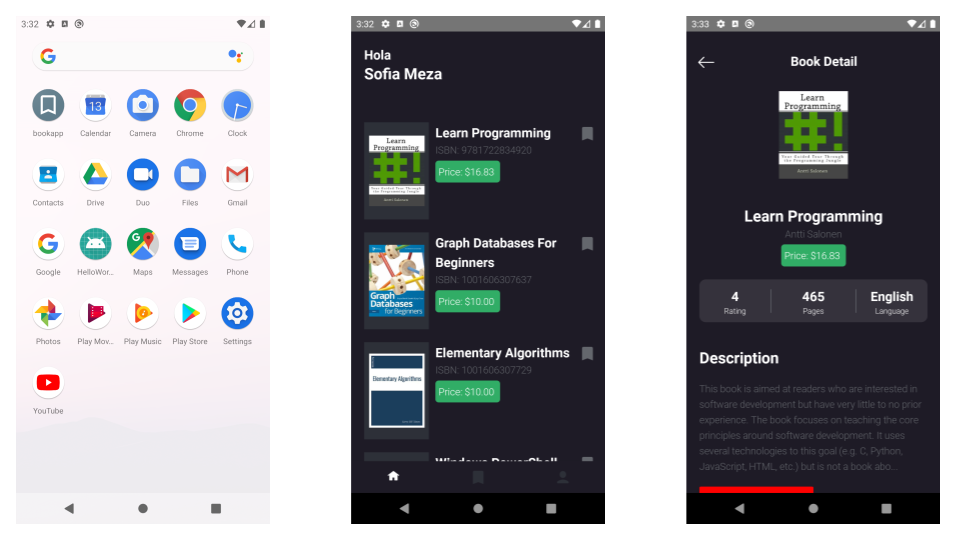

# BookApp

Aplicación de ejercicio, para el uso de AsyncStorage, Linking y Flatlist.

- Crea reviews y sube imágenes de los libros que hayas leido.
- Agrega al boomark los libros que ya leiste

## Installation

Descarga el [APK](https://github.globant.com/sofia-meza/BookApp/blob/production/android/app/release/app-release.apk)
* Guía para instalar un APK en tu celular [aquí](https://www.xatakandroid.com/tutoriales/como-instalar-aplicaciones-en-apk-en-un-movil-android)

## Pantallas
